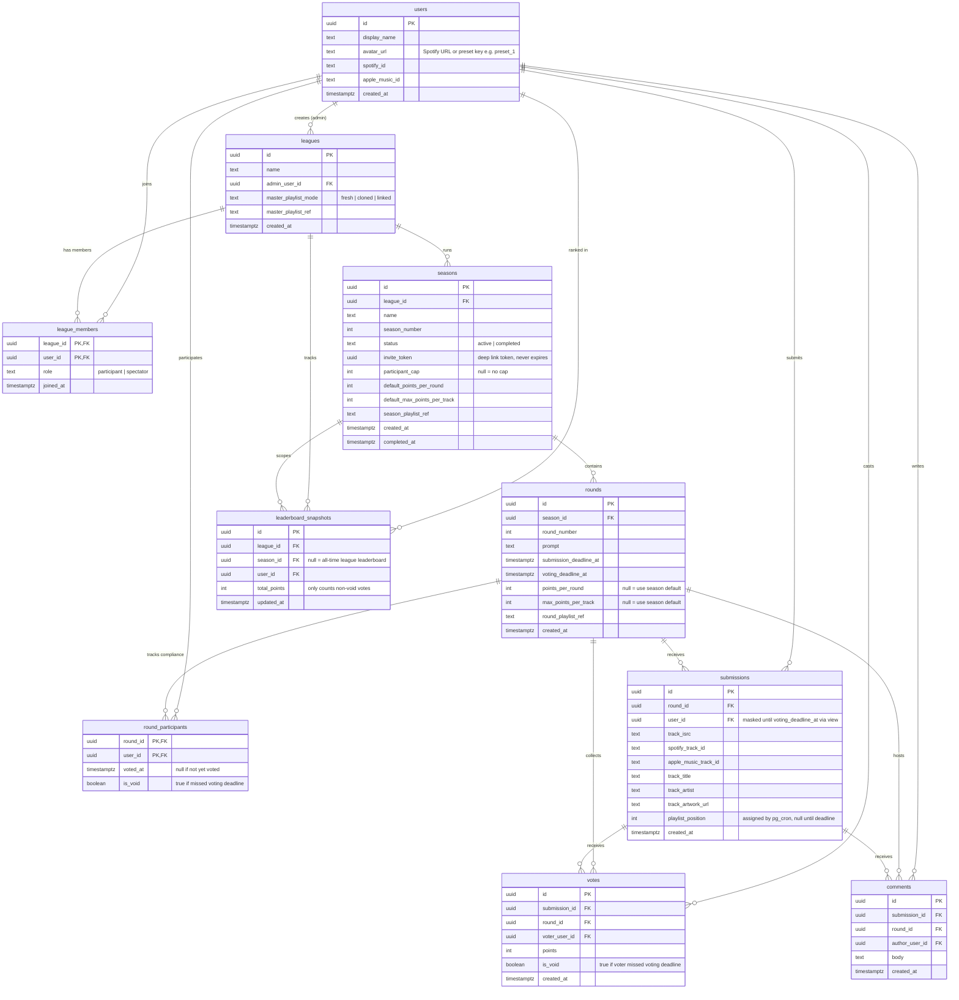

# mix — Database ERD

> Generated: 2026-04-12  
> Schema version: v2  
> Tool: Mermaid (renders in GitHub, Notion, VS Code with Markdown Preview Mermaid extension)

---

## Notes

- **Round status** is derived from timestamps, not stored:
  - `now() < submission_deadline_at` → `open_submissions`
  - `submission_deadline_at ≤ now() < voting_deadline_at` → `voting`
  - `now() ≥ voting_deadline_at` → `completed`
- **`submissions.user_id`** is masked from clients during voting phase via the `submissions_public` view. Revealed after `voting_deadline_at` passes.
- **`votes.is_void`** and **`round_participants.is_void`** are set by pg_cron when a player misses the voting deadline. Their received votes are stored in full for superlative tracking ("ghost points") but excluded from leaderboard tallies.
- **`rounds.points_per_round`** and **`rounds.max_points_per_track`** fall back to season defaults when null.
- **`seasons.invite_token`** is a UUID deep link token (`mix://join?token=<uuid>`), never expires. Anyone following it joins the league + that season. If `participant_cap` is reached, they are forced into `spectator` role.
- **`league_members.role`**: `participant` can submit/vote/comment. `spectator` is read-only but can view all rounds, playlists, results. Spectators can upgrade to participant if a spot opens.

---

